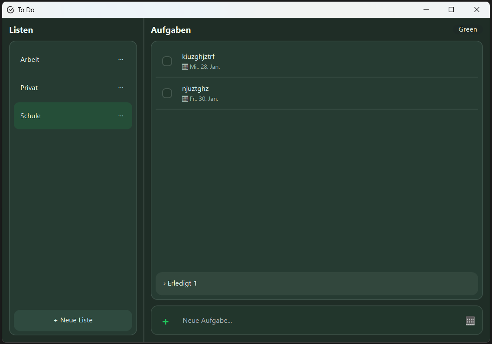
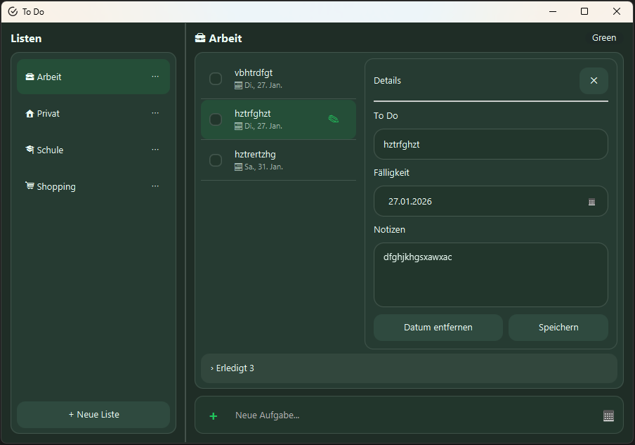

# Projektinformationen

**Download:**

Projektdateien kontrollieren, danach im Terminal des Projektes "mvn clean package" (erstellt den installer von neuem). Anschliessend im Projekt im Ordner target/installer To Do-1.0.0.msi herunterladen.





# Projekt: **TodoApp** – Aufgabenverwaltung

## 1. Ausgangslage

Im Rahmen des Programmierprojekts an der ZbW wird eine moderne Aufgabenverwaltung (**TodoApp**) entwickelt.
Die Anwendung dient der strukturierten Erfassung, Organisation und Bearbeitung von Aufgaben und Kategorien mit persistenter Speicherung in einer SQLite-Datenbank.

Das Projekt umfasst neben der Implementierung auch konzeptionelle Artefakte wie UML-Klassendiagramm, ERM, GUI-Entwurf sowie eine Prozessbeschreibung.
Die Versionierung erfolgt mittels Git. Eine Export- und Wiederherstellungsfunktion der Datenbank ist vorgesehen.

---

## 2. Zielsetzung

Ziel ist die Entwicklung einer **klar strukturierten, benutzerfreundlichen Desktop-Anwendung** mit sauberer Architektur, konsistentem Design und erweiterbarer Codebasis.

### Ziele im Überblick

- Verwaltung von Aufgaben (CRUD)
- Kategoriebasierte Organisation
- Fälligkeits- und Statusverwaltung
- Persistente Datenspeicherung (SQLite)
- Moderne JavaFX-GUI
- Mehrere UI-Farbthemes (umschaltbar)
- UML-Klassendiagramm und ERM
- Datenbank-Export und -Wiederherstellung
- Versionsverwaltung mit Git

---

## 3. Funktionsumfang

### 3.1 Muss-Funktionen

- Aufgabe erstellen
- Aufgabe anzeigen (Listenansicht)
- Aufgabe bearbeiten
- Aufgabe löschen
- Aufgabenstatus verwalten (Offen, Erledigt)
- Fälligkeitsdatum erfassen
- Kategorien erstellen, bearbeiten und löschen
- Aufgaben nach Kategorie filtern
- Persistente Speicherung in SQLite
- Grafische Benutzeroberfläche (JavaFX)

### 3.2 Erweiterte Funktionen (bereits umgesetzt oder vorbereitet)

- Archivbereich für erledigte Aufgaben
- Kontextmenüs (z. B. Kategorien bearbeiten)
- Dynamische Themes (Light, Dim, Blue, Green, Purple, High Contrast)
- Theme-Auswahl über Toggle-/Popup-Menue
- Tastatur- und Mausinteraktion
- Konsistente Styling-Variablen über alle Themes

---

## 4. GUI-Übersicht

### Hauptfenster

#### Linke Seite – Kategorien

- Kategorienliste
- Aktive Kategorie hervorgehoben
- Kontextmenü pro Kategorie (Bearbeiten / Löschen)
- Button: **+ Neue Liste**

#### Rechte Seite – Aufgaben

- Aufgabenliste der selektierten Kategorie
- Anzeige:

  - Titel
  - Fälligkeitsdatum
  - Status (Checkbox)

- Bereich **„Erledigt“** (einklappbar)
- Button: **+ Neue Aufgabe**

#### Kopfbereich

- Applikationstitel
- Theme-Anzeige / Theme-Auswahl (Popup)

---

## 5. Architekturübersicht (UML – Beschreibung)

### Zentrale Klassen

#### TodoItem

**Attribute**

- id : int
- title : String
- dueDate : LocalDate?
- completed : boolean
- categoryId : int

**Methoden**

- isOverdue(today) : boolean
- toggleCompleted()

---

#### Category

**Attribute**

- id : int
- name : String

**Methoden**

- rename(name)

---

#### TodoService

Business-Logik-Schicht zwischen GUI und Persistence.

**Methoden**

- createTodo(...)
- updateTodo(...)
- deleteTodo(id)
- toggleDone(id)
- getTodosByCategory(categoryId)

---

#### Repository-Schicht

- Kapselt SQLite-Zugriffe
- Keine Business-Logik
- Saubere Trennung von UI und Datenhaltung

---

## 6. ERM – Entity-Relationship-Modell

### Entitäten

#### TodoItems

- id (PK)
- title
- dueDate
- completed
- categoryId (FK)

#### Categories

- id (PK)
- name (UNIQUE)

### Beziehungen

- Category 1 : n TodoItems

---

## 7. Prozessbeschreibung

### Aufgabe erfassen

1. Benutzer klickt auf **„Neue Aufgabe“**
2. Eingabefeld wird aktiviert
3. Pflichtfelder werden validiert
4. Aufgabe wird gespeichert
5. UI wird automatisch aktualisiert

### Kategorie verwalten

1. Kontextmenü öffnen
2. Kategorie bearbeiten oder löschen
3. Änderungen werden persistent gespeichert

### Theme wechseln

1. Theme-Toggle anklicken
2. Popup mit Theme-Auswahl erscheint
3. Theme wird sofort angewendet
4. Auswahl wird persistent gespeichert

---

## 8. Datenhaltung

- SQLite-Datenbank
- Initialisierung beim ersten Start
- Struktur über Code definiert
- Vorbereitung für Export / Import vorhanden

---

## 9. Versionierung

### Repository-Struktur

- `src/` – Quellcode
- `resources/` – FXML, CSS, Assets
- `db/` – Datenbankdateien
- `docs/` – Diagramme und Dokumentation

### Vorgehen

- Regelmässige Commits
- Nachvollziehbare Commit-Messages
- Erweiterbarkeit und Wartbarkeit im Fokus

---

## 10. Zusammenfassung

**TodoApp** ist eine moderne, erweiterbare JavaFX-Aufgabenverwaltung mit klarer Architektur, konsistentem UI-Design und sauberer Trennung von Logik und Datenhaltung.
Durch die Verwendung von CSS-Variablen, mehreren Themes und strukturierter Business-Logik eignet sich das Projekt sowohl als Ausbildungsprojekt als auch als Grundlage für weiterführende Erweiterungen.

---

## Klassendiagramm

```
assets/UML-Klassendiagramm-ToDoListe.drawio.svg
```

## ERM-Modell

```
assets/ERM-Modell-ToDoListe.drawio.svg
```

## Farbkonzept

- Einheitliche CSS-Variablen (`-fx-c-*`)
- Themes:

  - Light
  - Dim
  - Blue
  - Green
  - Purple
  - High Contrast

---
